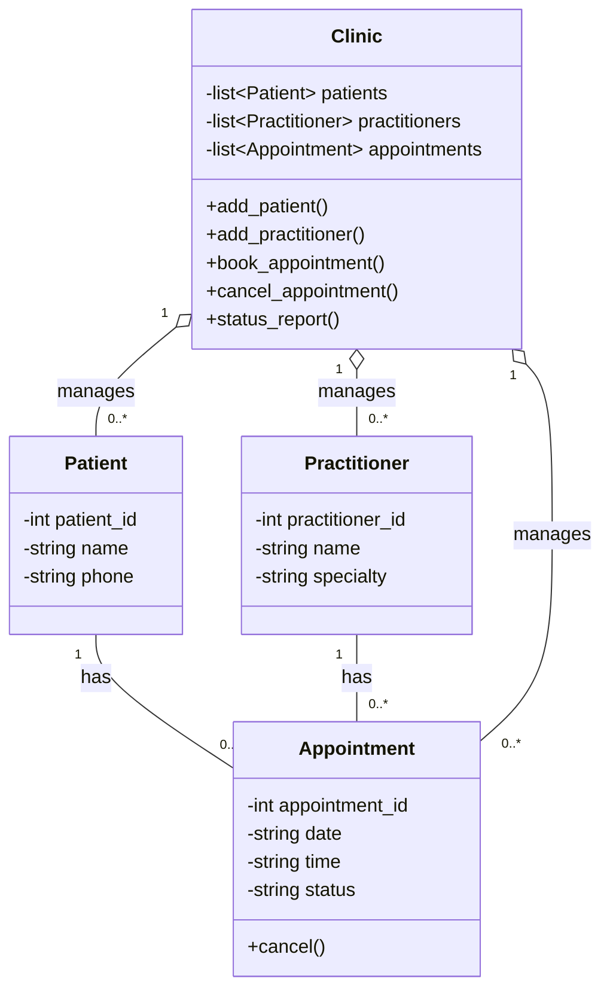

# SmartCare v0.3 – Domain Model Workbook

*Produced following the Stage 3 Lab process: model drafted AI OFF, reviewed AI ON, compared, then verified against v0.2's requirements.*

## Requirement-to-Concept Trace

| Requirement | Concept | State/behaviour | Decision |
|---|---|---|---|
| FR-01 (add patient record) | Patient | State — name, phone | Modelled as attributes on the Patient class. |
| FR-03 (search patient by name) | Patient (searched externally) | Behaviour — find/search | Not a Patient responsibility itself; modelled as an operation on the coordinating Clinic class, which has visibility over the whole patient list. |
| FR-04 (add practitioner record) | Practitioner | State — name, specialty | Modelled as attributes on the Practitioner class. |
| FR-06 (book appointment) | Appointment | State — linked patient, practitioner, date, time | Modelled as attributes/associations on the Appointment class. |
| FR-07 (cancel appointment) | Appointment | Behaviour — change own status | Modelled as a `cancel()` method on Appointment itself — it only needs to change its own state. |
| FR-08 (retain cancelled appointments) | Appointment | State — status, not deletion | Confirms status is a retained attribute rather than the object being removed. |
| FR-09 (view patient's appointment history) | Patient ↔ Appointment | Behaviour — history lookup | Confirms a 1-to-many association from Patient to Appointment (a Patient's history is the set of Appointments referencing it). |
| FR-10 (view practitioner's schedule) | Practitioner ↔ Appointment | Behaviour — schedule lookup | Confirms a 1-to-many association from Practitioner to Appointment. |
| FR-11 (prevent double-booking) | Clinic (coordinating) | Behaviour — conflict check across appointments | An individual Appointment can't see other appointments, so this is modelled as a Clinic responsibility, not an Appointment one. |
| FR-12 (status report) | Clinic (coordinating) | Behaviour — aggregate/report | Requires visibility across all appointments, so modelled as a Clinic responsibility rather than something any single class can do alone. |

## CRC Cards

### Patient

| Responsibilities | Collaborators |
|---|---|
| Know its own identifying and contact details (name, phone). | — |
| Know its own appointment history. | Appointment |

### Practitioner

| Responsibilities | Collaborators |
|---|---|
| Know its own identifying details (name, specialty). | — |
| Know its own schedule of upcoming appointments. | Appointment |

### Appointment

| Responsibilities | Collaborators |
|---|---|
| Know the patient and practitioner involved, and the date/time. | Patient, Practitioner |
| Track and update its own status (Scheduled/Cancelled). | — |

### Optional class — Clinic

| Responsibilities | Collaborators |
|---|---|
| Coordinate creation of new Patients, Practitioners and Appointments, and hold the overall collections. | Patient, Practitioner, Appointment |
| Check for scheduling conflicts before confirming a new Appointment, and produce the appointment-status report. | Appointment |

## UML Class Diagram

*(Renders automatically in GitHub's markdown preview and in VS Code with a Mermaid extension.)*

## Design Rationale

The model settled on three core domain classes — Patient, Practitioner and Appointment — because these are the only concepts in the v0.2 requirements with their own identity, data and behaviour distinct from being just an attribute of something else, as reasoned in the Tutorial's Candidate Concepts activity. A fourth, optional Clinic class was added specifically to hold responsibilities that don't naturally belong to any single Patient, Practitioner or Appointment: checking for scheduling conflicts across all existing appointments (FR-11) and producing the status report (FR-12). Both require visibility across the whole collection of appointments, which an individual Appointment object can't have about its peers.

Patient and Practitioner are each linked to Appointment through a one-to-many association rather than composition or inheritance. An Appointment isn't "part of" a Patient in a sense where deleting the Patient should delete its appointments — FR-08 explicitly requires cancelled appointments to be retained — and an Appointment isn't a type of Patient or Practitioner, ruling out inheritance; it's a separate concept that connects the two. Clinic's relationship to all three classes is modelled as aggregation (hollow diamond) rather than composition, since the Tutorial's reasoning concluded Clinic doesn't need to exclusively own every object — it just needs visibility across them to do its coordinating job.

No per-entity manager/controller classes, and no NotificationManager or ScheduleEngine, were added — per the Tutorial's AI Model Critique, none of those are supported by confirmed v0.2 requirements, and adding them now would be speculative design rather than evidence-based.

## AI Design Review Record

**Prompt used:** *"Suggest classes and relationships for the SmartCare domain model using only confirmed requirements from v0.2. For every suggestion, cite the specific requirement ID(s) it's based on."*

| AI suggestion | Evidence | Decision | Reason | Model change |
|---|---|---|---|---|
| Add a Clinic class to coordinate booking-conflict checks and reporting. | FR-11, FR-12 | Accepted | Both requirements need visibility across all appointments that no single Appointment object has on its own. | Added Clinic as the optional fourth class, aggregating Patient/Practitioner/Appointment. |
| Add separate PatientManager, PractitionerManager and AppointmentManager classes to isolate persistence/CRUD logic. | None cited — general design-pattern advice, not tied to an FR/NFR | Rejected | No requirement asks for that separation; three domain classes plus Clinic already matches the "small, maintainable" system the client asked for. | None. |
| Model Appointment status as a separate Status class rather than a plain attribute. | Loosely tied to FR-08 | Modified | FR-08 only requires status to be retained, not that status have its own identity/behaviour — a class would be over-engineering for two or three values. | Kept status as a simple attribute on Appointment instead of adding a class. |
| Add a NotificationManager to send reminders when appointments are booked. | None — reminders are only an open question in v0.2 Section 7 | Rejected | Adding a class for an unconfirmed feature is the kind of overreach flagged in the Stage 2 AI review. | None. |
| Give Patient and Practitioner a shared Person superclass, since both have a name field. | Not tied to a specific FR — structural similarity only | Rejected (kept unverified) | The two classes don't share behaviour beyond a name; inheritance for one shared field adds complexity without a confirmed requirement driving it. Worth revisiting only if a real shared requirement (e.g. both needing a login) appears later. | None. |

## Reflection

The hardest decision was whether to add a Clinic class at all. Every other class mapped cleanly onto something the client had actually described, but Clinic doesn't correspond to a single client statement — it exists purely to hold responsibilities that don't belong to any one entity, like checking for double-bookings across the whole appointment list. It felt like a judgement call rather than a direct trace from a requirement, which is why it's kept as an "optional" class with the two specific requirements (FR-11, FR-12) that justify it documented explicitly, rather than treating it as automatically obvious.

The AI over-designed in a few predictable places: separate Manager classes for each entity, a NotificationManager for a feature that's still just an open question, and a shared Person superclass based only on Patient and Practitioner both having a name field. None of these traced back to a confirmed requirement ID, which is exactly the test the Lab asked to be applied.

What actually held up was checking every suggestion against a specific FR or NFR number before accepting it. The Clinic class survived that test because two requirements genuinely need it; the Manager classes and Person superclass didn't survive it because nothing in v0.2 asks for that structure yet. Evidence, not plausibility, is what separated the accepted suggestions from the rejected ones.
